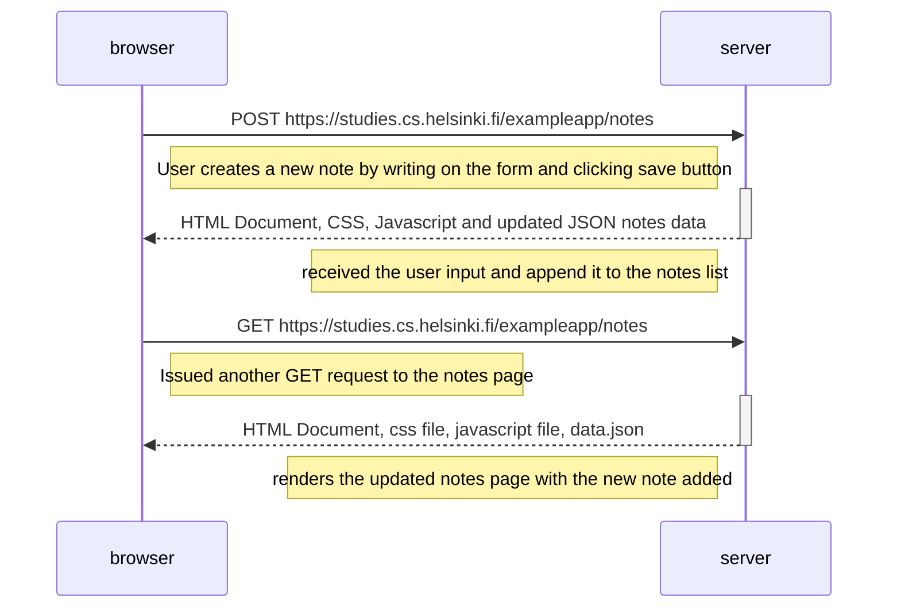

```mermaid
sequenceDiagram
    participant browser
    participant server


    browser->>server: POST https://studies.cs.helsinki.fi/exampleapp/notes
    Note right of browser: User creates a new note by writing on the form and clicking save button
    activate server
    server-->>browser: HTML Document, CSS, Javascript and updated JSON notes data
    deactivate server
    Note left of server: received the user input and append it to the notes list
 
    browser->>server: GET https://studies.cs.helsinki.fi/exampleapp/notes
    Note right of browser: Issued another GET request to the notes page 
    activate server
    server-->>browser: HTML Document, css file, javascript file, data.json
    deactivate server

    Note left of server: renders the updated notes page with the new note added
```