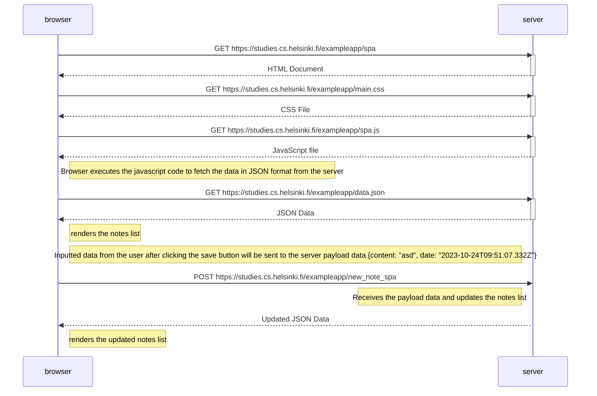

```mermaid
sequenceDiagram
    participant browser
    participant server

    browser->>server: GET https://studies.cs.helsinki.fi/exampleapp/spa
    activate server
    server-->>browser: HTML Document
    deactivate server

    browser->>server: GET https://studies.cs.helsinki.fi/exampleapp/main.css
    activate server
    server-->>browser: CSS File
    deactivate server

    browser->>server: GET https://studies.cs.helsinki.fi/exampleapp/spa.js
    activate server
    server-->>browser: JavaScript file
    deactivate server
    Note right of browser: Browser executes the javascript code to fetch the data in JSON format from the server

    browser->>server: GET https://studies.cs.helsinki.fi/exampleapp/data.json
    activate server
    server-->>browser: JSON Data
    deactivate server
    Note right of browser: renders the notes list

    Note right of browser: Inputted data from the user after clicking the save button will be sent to the server payload data {content: "asd", date: "2023-10-24T09:51:07.332Z"}
    browser->>server: POST https://studies.cs.helsinki.fi/exampleapp/new_note_spa
    Note left of server: Receives the payload data and updates the notes list
    activate server
    server-->>browser: Updated JSON Data
    Note right of browser: renders the updated notes list
```